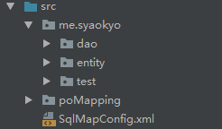
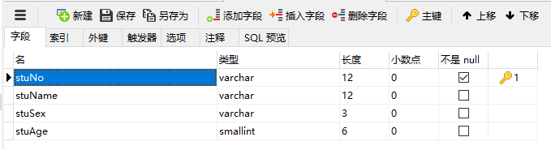
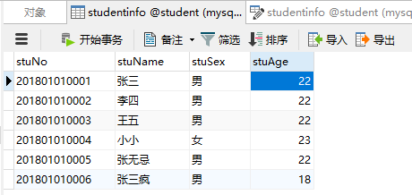
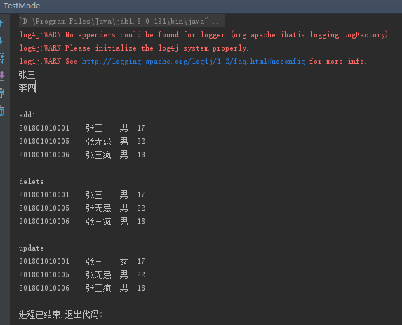

# mybatis框架

## 1 mybatis是什么

​	mybatis是一个持久层的框架，是apache下的顶级项目。

​	mybatis让程序将主要精力放在sql上，通过mybatis提供的映射方式，自由灵活生成（半自动化，大部分需要程序员编写sql）满足需要sql语句。

​	mybatis可以将向 preparedStatement中的输入参数自动进行输入映射，将查询结果集灵活映射成java对象。


## 2 mybatis框架原理

<div align=center>
   
</div>


## 3 示例入门程序（Dao模式）

### 3.1 示例程序需求

- 根据学生id（主键）查询用户信息
- 根据学生名称模糊查询用户信息
- 添加学生
- 删除学生
- 修改学生

### 3.2 示例程序结构

<div align=center>
   
</div>


### 3.3 详细说明

1. 创建web项目，导入所需的jar包：

<div align=center>
   
</div>

2. 创建所需的包结构及所需文件
<div align=center>
   
</div>

   1. 在src目录下创建SqlMapConfig.xml文件，文件内容如下：

      ```xml
      <?xml version="1.0" encoding="UTF-8"?>
      <!DOCTYPE configuration
              PUBLIC "-//mybatis.org//DTD Config 3.0//EN"
              "http://mybatis.org/dtd/mybatis-3-config.dtd">
      <configuration>
          <!-- 和spring整合后 environments配置将废除-->
          <environments default="development">
              <environment id="development">
                  <!-- 使用jdbc事务管理-->
                  <transactionManager type="JDBC" />
                  <!-- 数据库连接池-->
                  <dataSource type="POOLED">
                      <property name="driver" value="com.mysql.jdbc.Driver" />
                      <property name="url" value="jdbc:mysql://localhost:3306/Student?useSSL=false" />
                      <property name="username" value="root" />
                      <property name="password" value="******（密码）" />
                  </dataSource>
              </environment>
          </environments>
          <mappers>
              <mapper resource="poMapping/Student.xml"/>
          </mappers>
      </configuration>
      ```

   2. 在entity目录下创建Student实体类，内容如下：

      ```java
      package me.syaokyo.entity;
      
      /**
       * Created by SyaoKyo on 2018/9/4.
       */
      public class Student {
      
          private String stuNo;
          private String stuName;
          private String stuSex;
          private int stuAge;
      
          public Student(String stuNo, String stuName, String stuSex, int stuAge) {
              this.stuNo = stuNo;
              this.stuName = stuName;
              this.stuSex = stuSex;
              this.stuAge = stuAge;
          }
      
          public Student() {
          }
      
          public String getStuNo() {
              return stuNo;
          }
      
          public void setStuNo(String stuNo) {
              this.stuNo = stuNo;
          }
      
          public String getStuName() {
              return stuName;
          }
      
          public void setStuName(String stuName) {
              this.stuName = stuName;
          }
      
          public String getStuSex() {
              return stuSex;
          }
      
          public void setStuSex(String stuSex) {
              this.stuSex = stuSex;
          }
      
          public int getStuAge() {
              return stuAge;
          }
      
          public void setStuAge(int stuAge) {
              this.stuAge = stuAge;
          }
      }
      ```

   3. 在poMapping包下创建Student.xml映射文件，内容如下：

      **这里注意要将Student.xml文件添加到SqlMapConfig.xml文件中（上面的SqlMapConfig.xml文件中已经添加好了）**

      ```xml
      <?xml version="1.0" encoding="UTF-8"?>
      <!DOCTYPE mapper
              PUBLIC "-//mybatis.org//DTD Mapper 3.0//EN"
              "http://mybatis.org/dtd/mybatis-3-mapper.dtd">
      <mapper namespace="po.student">
          <select id="selectStuById" parameterType="java.lang.String" resultType="me.syaokyo.entity.Student">
              select * from studentInfo where stuNo=#{aaa}
          </select>
          <select id="selectByFirstName" parameterType="java.lang.String" resultType="me.syaokyo.entity.Student">
              select * from studentInfo where stuName like '${value}%'
          </select>
          <insert id="addStudent" parameterType="me.syaokyo.entity.Student">
              insert into studentInfo values(#{stuNo},#{stuName},#{stuSex},#{stuAge})
          </insert>
          <delete id="deleteStudentById" parameterType="java.lang.String">
              delete from studentInfo where stuNo=#{stuNo}
          </delete>
          <update id="updateStudentById" parameterType="me.syaokyo.entity.Student">
              update studentInfo set stuName=#{stuName},stuSex=#{stuSex},stuAge=#{stuAge} where stuNo=#{stuNo}
          </update>
      </mapper>
      ```

   4. 在dao目录下创建StudentDao.java ，内容如下：

      ```java
      package me.syaokyo.dao;
      
      import me.syaokyo.entity.Student;
      import org.apache.ibatis.io.Resources;
      import org.apache.ibatis.session.SqlSession;
      import org.apache.ibatis.session.SqlSessionFactory;
      import org.apache.ibatis.session.SqlSessionFactoryBuilder;
      
      import java.io.IOException;
      import java.io.InputStream;
      import java.util.List;
      
      /**
       * Created by SyaoKyo on 2018/9/4.
       */
      public class StudentDao {
      
          //根据编号查询
          public Student queryById(String id) throws IOException {
              Student stu = null;
              // 1.读取SqlMapConfig.xml配置文件
              String path = "SqlMapConfig.xml";
              InputStream in = Resources.getResourceAsStream(path);
              // 创建会话工厂
              SqlSessionFactory factory = new SqlSessionFactoryBuilder().build(in);
              // 获得会话
              SqlSession session = factory.openSession();
              // 第一个参数：映射文件中select标签的id（statement的id）
              // 第二个参数：和映射文件中指定的parameterType类型相同的参数
              stu = session.selectOne("selectStuById", id);
              return stu;
          }
      
          //根据姓氏查询
          public List<Student> selectByFirstName(String firstName) throws IOException {
              List<Student> list = null;
              // 1.读取SqlMapConfig.xml配置文件
              String path = "SqlMapConfig.xml";
              InputStream in = Resources.getResourceAsStream(path);
              // 创建会话工厂
              SqlSessionFactory factory = new SqlSessionFactoryBuilder().build(in);
              // 获得会话
              SqlSession session = factory.openSession();
              list = session.selectList("selectByFirstName", firstName);
              return list;
          }
      
          //增加学生
          public void addStudent(Student stu) throws IOException {
              // 1.读取SqlMapConfig.xml配置文件
              String path = "SqlMapConfig.xml";
              InputStream in = Resources.getResourceAsStream(path);
              // 创建会话工厂
              SqlSessionFactory factory = new SqlSessionFactoryBuilder().build(in);
              // 获得会话
              SqlSession session = factory.openSession();
      
              session.insert("addStudent", stu);
              // 提交事务
              session.commit();
              session.close();
          }
      
          //删除学生
          public void deleteStudentById(String id) throws IOException {
              // 1.读取SqlMapConfig.xml配置文件
              String path = "SqlMapConfig.xml";
              InputStream in = Resources.getResourceAsStream(path);
              // 创建会话工厂
              SqlSessionFactory factory = new SqlSessionFactoryBuilder().build(in);
              // 获得会话
              SqlSession session = factory.openSession();
              session.delete("deleteStudentById", id);
              // 提交事务
              session.commit();
              session.close();
          }
      
          //更新学生
          public void updateStudentById(Student stu) throws IOException {
              // 1.读取SqlMapConfig.xml配置文件
              String path = "SqlMapConfig.xml";
              InputStream in = Resources.getResourceAsStream(path);
              // 创建会话工厂
              SqlSessionFactory factory = new SqlSessionFactoryBuilder().build(in);
              // 获得会话
              SqlSession session = factory.openSession();
              session.update("updateStudentById", stu);
              // 提交事务
              session.commit();
              session.close();
          }
      }
      ```

   5. 最后为了验证程序是否能运行，还要测试一下，创建testMode.java ：

      ```java
      package me.syaokyo.test;
      
      import me.syaokyo.dao.StudentDao;
      import me.syaokyo.entity.Student;
      
      import java.io.IOException;
      import java.util.List;
      
      /**
       * Created by SyaoKyo on 2018/9/4.
       */
      public class TestMode {
          public static void main(String[] args) throws IOException {
              StudentDao dao =new StudentDao();
              System.out.println(dao.queryById("201801010001").getStuName());
              System.out.println(dao.queryById("201801010002").getStuName());
              System.out.println("\nadd:");
      
              //addStudent
              Student s=new Student("201801010007","李白","男",18);
              dao.addStudent(s);
      
              List<Student> list1 = dao.selectByFirstName("张");
              int listSize = list1.size();
              for (int i=0;i<listSize;i++){
                  System.out.println(list1.get(i).getStuNo()+'\t'+
                          list1.get(i).getStuName()+ '\t'+
                          list1.get(i).getStuSex()+'\t'+
                          list1.get(i).getStuAge());
              }
              System.out.println("\ndelete:");
      
              //deleteStudent
              dao.deleteStudentById("201801010007");
      
              list1 = dao.selectByFirstName("张");
              listSize = list1.size();
              for (int i=0;i<listSize;i++){
                  System.out.println(list1.get(i).getStuNo()+'\t'+
                          list1.get(i).getStuName()+ '\t'+
                          list1.get(i).getStuSex()+'\t'+
                          list1.get(i).getStuAge());
              }
              System.out.println("\nupdate:");
      
              //updateStudent
              Student stu=new Student("201801010001","张三","女",17);
              dao.updateStudentById(stu);
      
              list1 = dao.selectByFirstName("张");
              listSize = list1.size();
              for (int i=0;i<listSize;i++){
                  System.out.println(list1.get(i).getStuNo()+'\t'+
                          list1.get(i).getStuName()+ '\t'+
                          list1.get(i).getStuSex()+'\t'+
                          list1.get(i).getStuAge());
              }
          }
      }
      ```

3. 在数据库中创建表

<div align=center>
   
</div>

4. 在表中添加数据

<div align=center>
   
</div>


## 4 运行结果

<div align=center>
   
</div>
​      


